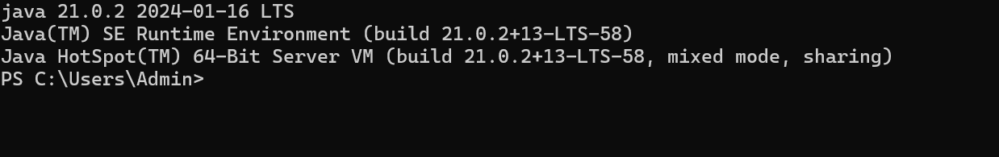
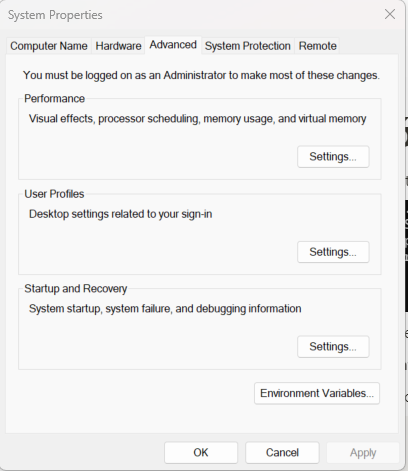
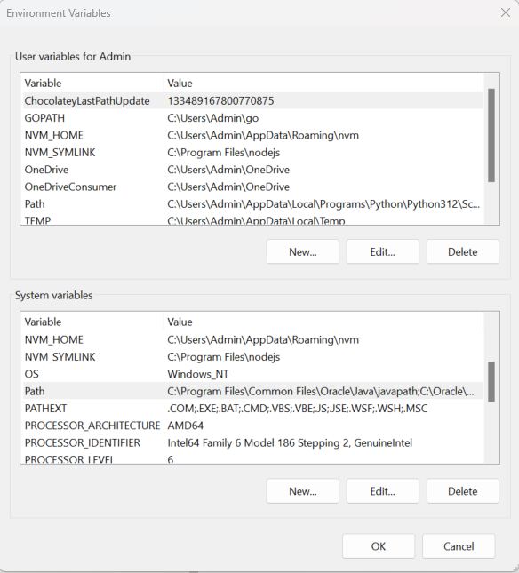
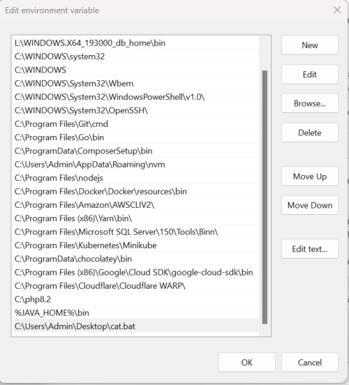
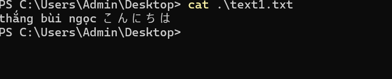

# java-interview

# ls Command Simulation

Simulated options for `ls` command:

- `-a` : Include directory entries whose names begin with a dot (`.`).
- `-A` : Almost the same as `-a`, but does not include the implied `.` and `..` entries.
- `-d` : List directories themselves, not their contents.
- `-F` : Append a character to each file name indicating the file type.
- `-l` : Use a long listing format.
- `-r` : Reverse the order of the sort.
- `-S` : Sort files by size.
- `-t` : Sort by modification time, newest first.

Comment quality: Similar to Unix output with comments.

# cat Command Simulation

Simulated options for `cat` command:

- `-n` : Number all output lines, helpful for viewing or debugging files with line number reference.
- `-v` : Display non-printing characters, making control and other non-printing characters visible, except for tabs and the end of line markers.
- `-sa` : Merge input files into 1 file. It is an optimize option of SanAn Software

Comment quality: Similar to Unix output with comments.

# Evaluation and Improvements

- Current algorithm is quite simple, so there hasn't been much optimization in terms of algorithm complexity. Basic techniques such as ArrayList, HashMap have been utilized for basic programming optimizations.
- Usage of `StringBuffer`, `StringBuilder` for optimizing file read/write operations.
- Employing Streams to handle large file scenarios.
- Investigated some issues related to comments, such as the “>`” option when using the `cat` command. However, due to Unix directionality issues, appropriate handling hasn't been implemented yet. We add an optimize option like '-sa' to cover this case.
# Alias Simulator Execution Guide

1. Install JDK 11 on Windows 11

1. Create a .bat file for execution on Windows scripts

(create “**cat.bat**”)

Content of **cat.bat**

```bash
@echo off
@START <path to handle file> "%1"
```

<path to handle file>: C:\Users\Admin\Documents\build\interview-questions\CatSimulation.java

1. Set up the .bat file in the PATH within the system environment
    1. Open System Properties → Advanced → Environment Variables
        
        
    2. After opening Environment Variables, a dialog box will appear
        
        
    3. Choose PATH → Edit
        
        Add an environment variable at the end, the value being the path to the .bat file you just created
        
        
2. Check the configuration of the .bat file you just created
    1. Open the terminal on your Windows machine
    2. Execute the command
    
    <Name of the bat file> <args defined>
        
